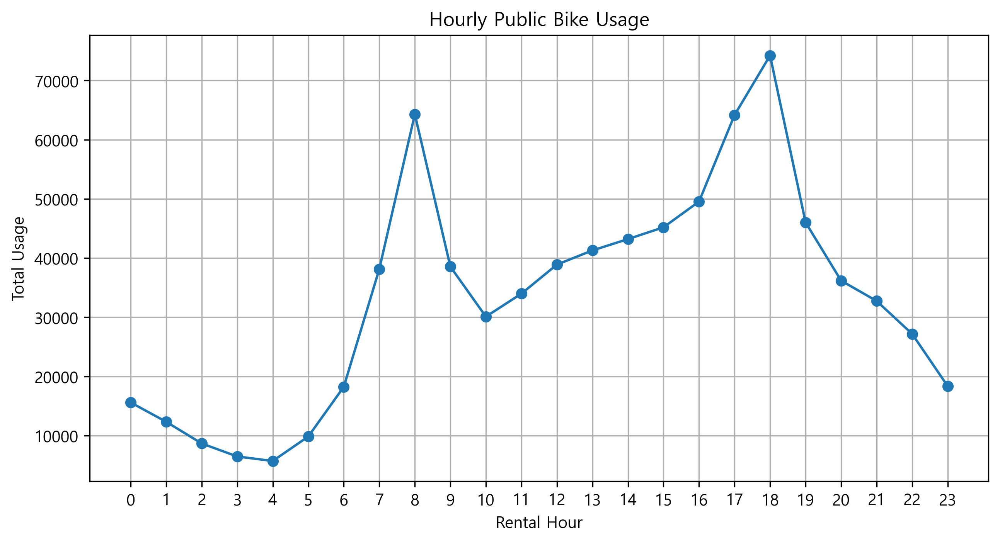
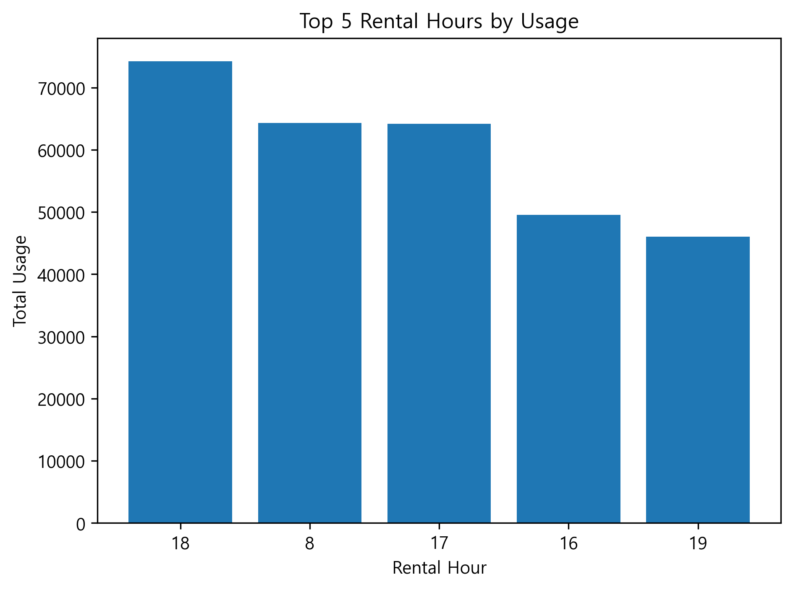
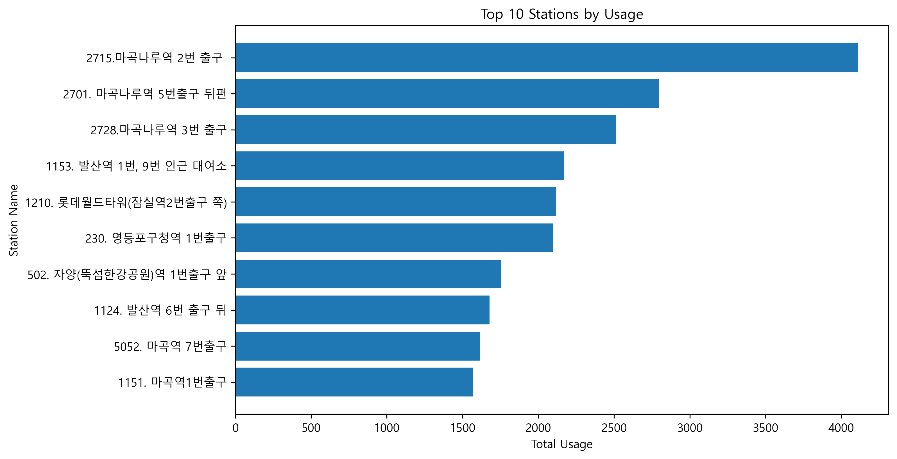
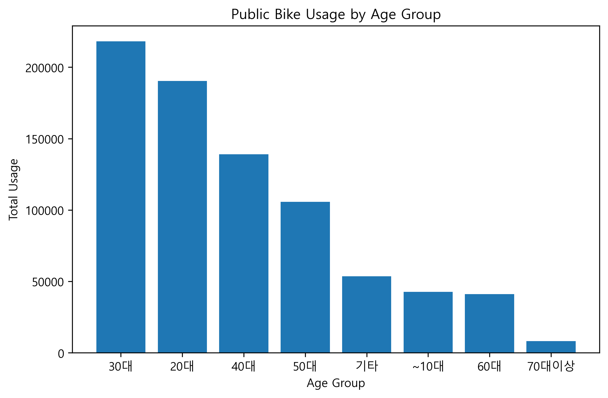

# 서울시 공공자전거 이용 패턴 분석

## 1. 프로젝트 개요

본 프로젝트는 서울시 공공자전거 이용 데이터를 활용하여 시간대, 대여소, 연령별 이용 패턴을 분석하는 것을 목표로 한다.

단순히 이용량을 확인하는 것이 아니라, 공공자전거 수요가 어떤 조건에서 집중되는지 파악하고, 향후 대여소 운영 및 자전거 재배치 전략에 활용할 수 있는 인사이트를 도출하는 것을 목적으로 한다.

## 2. 프로젝트 목적

- 시간대별 공공자전거 이용 패턴 분석
- 대여소별 이용량 차이 분석
- 연령대 및 성별 이용 패턴 분석
- 수요가 집중되는 시간대와 대여소 확인
- SQL과 Python을 활용한 데이터 분석 및 시각화 역량 증명

## 3. 사용 데이터

- 데이터명: 서울특별시 공공자전거 이용정보(시간대별)
- 데이터 출처: 서울 열린데이터광장
- 데이터 형식: CSV
- 분석 기간: 2025년 2월
- 주요 컬럼: 대여일자, 대여시간, 대여소번호, 대여소명, 대여구분코드, 성별, 연령대코드, 이용건수, 운동량, 탄소량, 이동거리
- 원본 데이터 파일은 용량 문제로 저장소(repository)에 포함하지 않았으며, 서울 열린데이터광장에서 직접 다운로드할 수 있다.
- 저장소에는 SQL 분석 결과를 내보낸 CSV 파일만 포함했다.

## 4. 사용 기술

- MySQL
- DBeaver
- Python
- pandas
- matplotlib
- Jupyter Notebook
- Tableau Public

## 5. 분석 질문

1. 공공자전거 이용량은 시간대별로 어떤 차이를 보이는가?
2. 이용량이 많은 시간대는 언제인가?
3. 이용량이 많은 대여소는 어디인가?
4. 주요 대여소의 시간대별 이용 패턴은 전체 이용 패턴과 다른가?
5. 연령대와 성별에 따라 이용량은 어떻게 다른가?
6. 이용량이 많은 시간대와 1회 평균 이동거리가 긴 시간대는 일치하는가?
7. 공공자전거 운영 관점에서 어떤 개선점을 제안할 수 있는가?


## 6. 프로젝트 진행 과정

### 1단계. 데이터 수집

서울 열린데이터광장에서 2025년 2월 서울특별시 공공자전거 이용정보(시간대별) CSV 데이터를 다운로드했다.

### 2단계. 데이터베이스 구축

MySQL에 분석용 데이터베이스 `bike_analysis_db`를 생성하고, 공공자전거 이용정보 데이터를 저장하기 위한 `bike_hourly_usage` 테이블을 설계했다.

CSV 데이터를 DBeaver를 활용해 MySQL 테이블에 적재한 뒤, 전체 행 수와 샘플 데이터를 확인하여 데이터가 정상적으로 적재되었는지 검증했다.

### 3단계. SQL 분석

MySQL을 활용하여 시간대별, 대여소별, 연령대별, 성별 이용량을 집계했다. 또한 `ROW_NUMBER()` 윈도우 함수를 활용하여 각 연령대별 최다 이용 시간대를 추출했다.

### 4단계. Python 분석 및 시각화

SQL 분석 결과를 CSV 파일로 내보낸 뒤, Python pandas로 데이터를 불러오고 matplotlib을 활용하여 주요 분석 결과를 시각화했다.

시각화한 항목은 다음과 같다.

- 시간대별 이용량 추이
- 이용량 상위 시간대 TOP 5
- 대여소별 이용량 TOP 10
- 연령대별 이용량

### 5단계. 인사이트 정리

SQL 분석 결과와 시각화 결과를 바탕으로 공공자전거 이용 패턴과 운영 개선 방향을 정리했다.

### 6단계. Tableau 대시보드 제작

Tableau Public을 활용하여 시간대별 이용량, 이용량 상위 시간대, 연령대별 이용량, 대여소별 이용량 TOP 10을 하나의 대시보드로 구성했다.


## 7. 주요 분석 결과

### 7-1. 시간대별 이용량 분석



2025년 2월 서울시 공공자전거 시간대별 이용량을 분석한 결과, 18시 이용건수가 74,214건으로 가장 높게 나타났다. 이어 8시 64,298건, 17시 64,151건, 16시 49,533건, 19시 46,011건 순으로 이용량이 많았다.

이를 통해 공공자전거 이용은 출근 시간대와 퇴근 시간대에 집중되는 경향을 보였으며, 특히 퇴근 시간대인 17~19시 구간의 수요가 두드러지게 나타났다.

### 7-2. 시간대 그룹별 이용량 분석

시간대 그룹별 총 이용건수는 오후가 282,247건으로 가장 높았고, 오전 223,300건, 저녁 189,143건, 새벽 58,623건, 밤 45,533건 순으로 나타났다.

다만 각 시간대 그룹의 길이가 서로 다르기 때문에 단순 총합만으로 수요 강도를 비교하는 데에는 한계가 있다. 예를 들어 오후는 12~17시로 6시간 구간인 반면, 저녁은 18~21시로 4시간 구간이다. 따라서 이후 분석에서는 시간대 그룹별 총합뿐 아니라 시간당 평균 이용량도 함께 비교할 필요가 있다.

### 7-3. 대여소별 이용량 분석


2025년 2월 서울시 공공자전거 대여소별 이용량을 분석한 결과, 마곡나루역 2번 출구 대여소가 4,107건으로 가장 높은 이용량을 기록했다. 이어 마곡나루역 5번출구 뒤편 2,798건, 마곡나루역 3번 출구 2,514건 순으로 나타났다.

상위 3개 대여소가 모두 마곡나루역 주변에 위치해 있어, 해당 지역에 공공자전거 수요가 집중되어 있음을 확인할 수 있다. 이는 지하철역과 주변 업무·주거 지역을 연결하는 단거리 이동 또는 환승 수요와 관련이 있을 가능성이 있다.

다만 현재 분석은 공공자전거 이용 데이터만을 기반으로 하므로, 마곡나루역 주변의 높은 이용량 원인을 명확히 설명하기 위해서는 지하철 승하차 인원, 주변 상권·업무시설, 주거 밀도 등의 추가 데이터와 결합한 분석이 필요하다.

### 7-4. 주요 대여소의 시간대별 이용 패턴 분석

대여소별 이용량 1위인 마곡나루역 2번 출구 대여소(station_id = 2715)를 대상으로 시간대별 이용량을 추가 분석했다.

분석 결과, 해당 대여소는 8시 이용건수가 559건으로 가장 높게 나타났으며, 이어 18시 522건, 19시 334건, 17시 312건, 20시 222건 순으로 나타났다.

서울시 전체 시간대별 이용량에서는 18시가 가장 높은 반면, 마곡나루역 2번 출구 대여소는 8시 이용량이 가장 높게 나타났다. 이를 통해 해당 대여소는 전체 평균적인 이용 패턴과 달리 출근 시간대 수요가 특히 강한 지점일 가능성이 있다.

또한 17~20시 이용량도 상위권에 포함되어 있어, 출근 시간대뿐 아니라 퇴근 시간대에도 높은 이용 수요가 존재하는 것으로 볼 수 있다.

### 7-5. 연령대별 이용량 분석


2025년 2월 서울시 공공자전거 이용량을 연령대별로 분석한 결과, 30대가 218,075건으로 가장 높은 이용량을 보였다. 이어 20대 190,323건, 40대 139,091건, 50대 105,799건 순으로 나타났다.

이를 통해 공공자전거 이용은 20~30대 중심으로 이루어지는 경향을 확인할 수 있다. 특히 30대와 20대의 이용량이 전체 상위권을 차지하고 있어, 출퇴근 및 생활권 내 단거리 이동 수요와 관련이 있을 가능성이 있다.

### 7-6. 성별 이용량 분석

성별 기준으로는 M 값이 409,717건으로 가장 높게 나타났고, F 값은 182,068건이었다. 다만 성별 값이 비어 있는 데이터가 207,061건으로 상당히 많아, 성별 이용 패턴을 단정적으로 해석하기에는 한계가 있다.

따라서 성별 분석 결과는 참고 지표로 활용하되, 결측값 처리 방식에 따라 해석이 달라질 수 있다는 점을 고려해야 한다.

### 7-7. 연령대별 최다 이용 시간대 분석

연령대별로 가장 이용량이 많은 시간대를 분석한 결과, 20대, 30대, 40대, 50대 모두 18시에 가장 높은 이용량을 보였다. 특히 30대는 18시에 22,818건으로 전체 연령대 중 가장 높은 이용량을 기록했다.

이는 앞서 전체 시간대별 분석에서 18시 이용량이 가장 높게 나타난 결과와도 연결된다. 즉, 18시의 높은 이용량은 특정 연령대에만 집중된 현상이 아니라, 20~50대 주요 이용 연령층 전반에서 공통적으로 나타나는 패턴으로 볼 수 있다.

반면 ~10대는 17시, 60대와 70대 이상은 16시에 가장 높은 이용량을 보였다. 이는 연령대에 따라 공공자전거 이용 목적과 시간대가 다를 가능성을 보여준다. 다만 현재 데이터만으로 이용 목적을 직접 확인할 수는 없기 때문에, 해당 결과는 시간대별 이용 패턴의 차이로 해석하는 것이 적절하다.

### 7-8. 시간대별 이동거리 분석

시간대별 1회 이용당 평균 이동거리를 분석하기 위해 단순 평균이 아니라 `총 이동거리 / 총 이용건수` 방식으로 계산했다. 이는 원본 데이터가 개별 이용 내역이 아니라 이용건수 단위로 집계된 데이터이기 때문에, 행 단위 평균보다 실제 1회 이용당 평균 이동거리를 더 적절하게 반영하기 위함이다.

분석 결과, 15시의 1회 평균 이동거리가 2,247m로 가장 길게 나타났으며, 이어 14시 2,230m, 16시 2,185m, 4시 2,094m, 17시 2,084m 순으로 나타났다.

앞선 이용건수 분석에서는 18시와 8시 등 출퇴근 시간대의 이용량이 높게 나타났지만, 평균 이동거리 기준으로는 14~16시 오후 시간대가 상위권을 차지했다. 이를 통해 이용량이 많은 시간대와 1회 이용당 이동거리가 긴 시간대가 반드시 일치하지 않는다는 점을 확인할 수 있다.

이는 출퇴근 시간대에는 비교적 짧은 환승·생활권 이동이 많고, 오후 시간대에는 상대적으로 긴 이동이나 여가성 이용이 포함될 가능성을 보여준다. 다만 현재 데이터에는 이용 목적 정보가 포함되어 있지 않으므로, 이동 목적을 직접적으로 단정하기에는 한계가 있다.

또한 4시는 평균 이동거리가 높게 나타났지만 이용건수가 5,709건으로 상대적으로 적기 때문에, 일부 긴 이동의 영향을 크게 받았을 가능성이 있다. 따라서 해당 시간대는 주요 패턴으로 보기보다는 참고값으로 해석하는 것이 적절하다.

## 8. 인사이트 및 제안

### 8-1. 출퇴근 시간대 운영 관리 강화

시간대별 이용량 분석 결과, 18시, 8시, 17시가 이용량 상위 시간대로 나타났다. 이는 공공자전거 이용이 출근 및 퇴근 시간대에 집중되는 경향이 있음을 보여준다.

따라서 출근 시간대와 퇴근 시간대에는 주요 대여소의 자전거 부족 또는 거치대 부족 문제가 발생할 가능성이 있다. 해당 시간대에는 수요가 많은 대여소를 중심으로 자전거 재배치와 거치 공간 관리가 필요하다.

### 8-2. 마곡나루역 주변 대여소 집중 관리

대여소별 이용량 분석 결과, 상위 3개 대여소가 모두 마곡나루역 주변에 위치했다. 특히 마곡나루역 2번 출구 대여소는 2025년 2월 기준 4,107건으로 가장 높은 이용량을 기록했다.

또한 해당 대여소는 서울시 전체 패턴과 달리 8시에 가장 높은 이용량을 보여, 출근 시간대 수요가 특히 강한 지점일 가능성이 있다. 따라서 마곡나루역 주변 대여소는 출근 시간대 자전거 배치 상태를 우선적으로 점검할 필요가 있다.

### 8-3. 시간대별 이용 목적 차이 가능성

이용건수 기준으로는 18시와 8시 등 출퇴근 시간대가 높게 나타났지만, 1회 평균 이동거리 기준으로는 14~16시 오후 시간대가 상위권을 차지했다.

이는 출퇴근 시간대에는 비교적 짧은 환승 또는 생활권 이동이 많고, 오후 시간대에는 상대적으로 긴 이동이나 여가성 이용이 포함될 가능성을 보여준다. 다만 현재 데이터에는 이용 목적 정보가 포함되어 있지 않으므로, 이를 명확히 확인하기 위해서는 추가 데이터가 필요하다.

## 9. 한계점

- 본 분석은 2025년 2월 한 달치 데이터만 사용했기 때문에 계절적 영향을 배제하기 어렵다. 겨울철 데이터라는 점에서 봄, 여름, 가을과 이용 패턴이 다를 수 있다.

- 성별 값이 비어 있는 데이터가 207,061건으로 상당히 많아, 성별 이용 패턴을 단정적으로 해석하기 어렵다.

- 현재 데이터에는 이용 목적 정보가 포함되어 있지 않기 때문에 출퇴근, 여가, 환승 등 실제 이용 목적을 직접 구분할 수 없다.

- 특정 대여소의 이용량이 높은 원인을 명확히 설명하기 위해서는 지하철 승하차 인원, 유동인구, 주변 상권, 업무시설, 주거 밀도 등의 외부 데이터가 추가로 필요하다.

- 시간대 그룹별 총 이용량은 그룹별 시간 길이가 서로 다르기 때문에 단순 총합만으로 수요 강도를 비교하는 데에는 한계가 있다.

## 10. 프로젝트 파일 구조

```text
bike_analysis/
├── README.md
├── data/
│   ├── age_group_usage.csv
│   ├── hourly_usage.csv
│   ├── top5_hourly_usage.csv
│   └── top10_station_usage.csv
├── sql/
│   ├── 01_create_database.sql
│   ├── 02_create_table.sql
│   └── 03_basic_analysis.sql
├── notebooks/
│   └── 01_visualization.ipynb
├── images/
│   ├── hourly_usage.png
│   ├── top5_hourly_usage.png
│   ├── top10_station_usage.png
│   └── age_group_usage.png
└── dashboard/
```

## Tableau 대시보드

Tableau Public을 활용하여 시간대별 이용량, 이용량 상위 시간대, 연령대별 이용량, 대여소별 이용량 TOP 10을 하나의 대시보드로 구성했다.

- [서울시 공공자전거 이용 패턴 대시보드](https://public.tableau.com/app/profile/.36142407/viz/_17838515093560/1?publish=yes)
